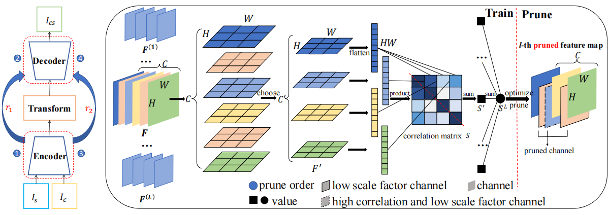

# Lighting Image/Video Style Transfer Methods by Iterative Channel Pruning
Kexin Wu, Fan Tang, Ning Liu, Oliver Deussen, Thi-ngoc-hanh Le, Weiming Dong, Tong-yee Lee
## Framework

## Experiments
### Requirements
* python=3.7
* torch=1.7.1
* PIL,numpy,tqdm,tensorboard
### Test
```
Image
python test_video.py --content_dir input/content/ --style_dir input/style/ --output output

Video
python test_video.py --content_dir input/content_video/ --style_dir input/style/ --output output
```
### Calculate FLOPs and parameters
```
python calculate_FLOPs.py
```

## Reference
If you use our work in your research, please cite us using the following BibTeX entry. Paper Link [\[pdf\]](https://ieeexplore.ieee.org/stamp/stamp.jsp?tp=&arnumber=10446950)
```
@inproceedings{wu2024lighting,
  title={Lighting Image/Video Style Transfer Methods by Iterative Channel Pruning},
  author={Wu, Kexin and Tang, Fan and Liu, Ning and Deussen, Oliver and Le, Thi-Ngoc-Hanh and Dong, Weiming and Lee, Tong-Yee},
  booktitle={ICASSP 2024-2024 IEEE International Conference on Acoustics, Speech and Signal Processing (ICASSP)},
  pages={3800--3804},
  year={2024},
  organization={IEEE}
}
```

